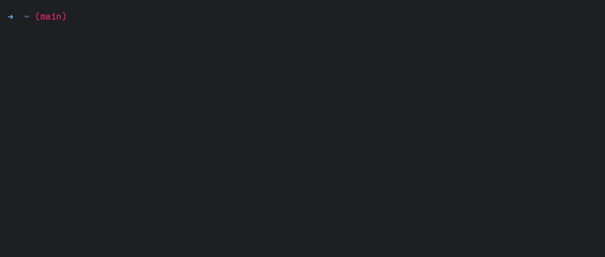

<p align="center">
    
</p>
<p align="center">
   
   
    
<a href="https://github.com/Cipheritall/cipherli/releases/latest">
</a>
</p>

------

# CipherLi
CipherLi is a command-line tool for file encryption and decryption using symmetric encryption.

## One shot Installation
   ```bash
   curl https://raw.githubusercontent.com/Cipheritall/cipherli/refs/heads/main/get.sh | sh
   ```
   
## Cloned Installation
1. Clone this repository or download the source code
2. Run the installation script:

   ```bash
   sudo ./install.sh
   ```

   This will:
   - Create the necessary directories
   - Set up a Python virtual environment
   - Install required dependencies
   - Create a system-wide `cipherLi` command

## Requirements

- Python 3.6 or higher
- python3-venv package
- Linux-based operating system

## Usage

### Basic Commands



Encrypt a file:

```bash
cipherLi encrypt "your-password" input-file.txt encrypted-file.enc
```

Decrypt a file:

```bash
cipherLi decrypt "your-password" encrypted-file.enc decrypted-file.txt
```

Encrypt a folder:

```bash
cipherLi encrypt "your-password" input-folder/ encrypted-folder/ -r
```

Decrypt a folder:

```bash
cipherLi decrypt "your-password" encrypted-folder/ decrypted-folder/ -r
```

The `-r` flag enables recursive processing of subfolders.

### Security Notes

- Always use strong passwords
- Keep your encrypted files and passwords separate
- Backup your files before encryption

## Technical Details

- Uses the `cryptography` library for secure encryption
- Implements AES-256 encryption in GCM mode
- Includes secure key derivation (PBKDF2)

## Version

<a href="https://github.com/Cipheritall/cipherli/releases/latest">

</a>

## License

This project is open source and available under the MIT License.
